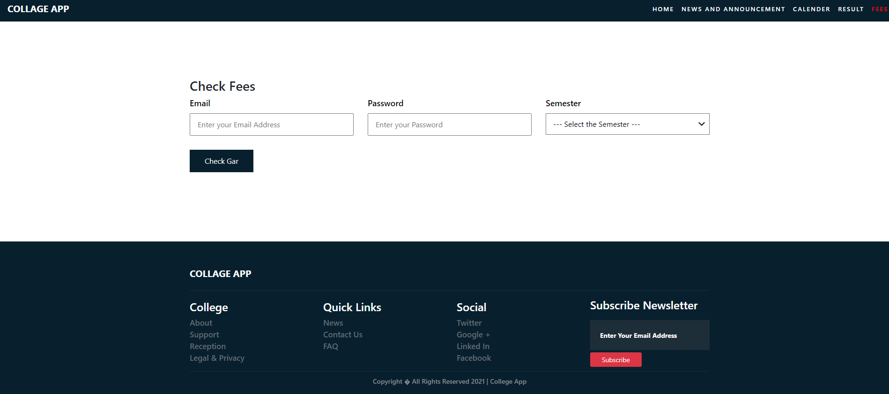
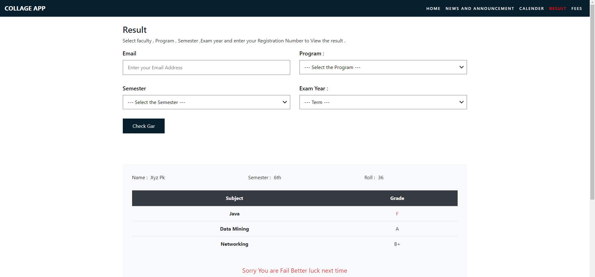

# Collage-app 
         [spring boot,thymeleaf templete,spring web,sql,jpaRepository,Spring security]
# 1)Clone project open in any IDE
                (eclipse ,netbean,intellij)
                it is mavin project
# 2)Open and create database in localhost xampp with name 
                  college-app
# 3)Open src/main/resources/applicatin.properties setup your database
                 spring.datasource.url=jdbc:mysql://localhost:3306/college_app
                 spring.datasource.username=root
                 spring.datasource.password=
# 4)Go to com.college run this file
                 application.java 
# 5)Open browser with 
                  http://localhost:8080 => userSide
                  http://localhost:8080/admin/login =>adminLogin
# 6)Default admin login 
                   id=> admin@gmail.com
                   pw=> admin
  
# 7) Screen shot
### Index

### Calender

### Fee

### Result

### Backend Index

 
  
Special thanks to <a href="https://github.com/anupjungkarki">anup karki</a> for User Interface design 
  https://github.com/anupjungkarki/College-App-Fontend

